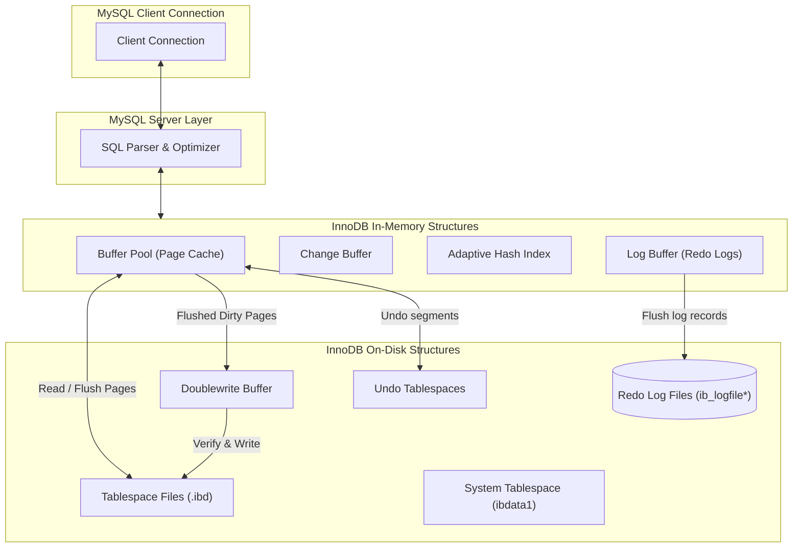

# Advanced DBMS: MySQL / InnoDB Storage Engine

This document explores the architecture and internals of the **MySQL InnoDB Storage Engine**, focusing on its clustered index design, transaction logging (Undo and Redo logs), row-level locking (including Gap and Next-Key locking), and its Oracle-style Multi-Version Concurrency Control (MVCC). It also presents a comparative analysis with PostgreSQL's heap-based, append-only architecture.

---

## 1. Problem Background

MySQL's original default storage engine was **MyISAM**, which was optimized for read-heavy workloads but suffered from critical limitations:
- **Table-Level Locking**: Any write operation locked the entire table, causing major concurrency bottlenecks.
- **No ACID Transactions**: MyISAM did not support transactions, rollback capabilities, or foreign keys.
- **Poor Crash Recovery**: If the server crashed during a write, MyISAM tables could easily become corrupted.

To solve these problems, Finnish company Innobase Oy developed the **InnoDB Storage Engine** (later acquired by Oracle and made the default storage engine in MySQL 5.5). InnoDB was designed as an enterprise-grade transactional storage engine featuring:
- **Row-Level Locking**: Maximizing concurrent writes by locking individual rows rather than tables.
- **ACID Compliance**: Full support for transactions, savepoints, and referential integrity constraints.
- **Durability and Self-Healing**: Utilizing write-ahead physical logs to recover automatically from crashes without table corruption.

---

## 2. Architecture Overview

InnoDB's internal architecture is divided into an in-memory buffer pool structure and on-disk file storage.



### Core Memory & Disk Components:
1. **Buffer Pool**: Caches table pages, index pages, undo pages, and change buffer segments in RAM.
2. **Doublewrite Buffer**: A physical disk area where InnoDB writes dirty pages from the Buffer Pool before writing them to the actual data files. This protects against partial page writes (corruption during power failure).
3. **Log Buffer**: Stores Redo Log entries in memory before flushing them sequentially to the physical on-disk Redo logs.
4. **Change Buffer**: Caches modifications to secondary indexes when the target pages are not in the Buffer Pool, reducing random disk I/O.

---

## 3. Internal Design

### Clustered Index & Primary Key Storage

The defining characteristic of InnoDB storage is that all tables are structured as clustered indexes (specifically, B+Trees).

- **Clustered Storage**: The table data is physically organized and stored inside the leaf nodes of the primary key B+Tree. The primary key is the B-Tree search key, and the leaf page contains the full column values for each row.
- **Implicit Primary Key**: If a table is created without an explicit Primary Key, InnoDB searches for a unique, non-null index to use. If none exists, InnoDB generates an implicit 64-bit row identifier (`row_id`) and clusters the table around it.
- **Secondary Index Structure**: Secondary indexes in InnoDB are separate B+Trees, but their leaf nodes do not contain physical row pointers. Instead, they store the **Primary Key value** of the matching row.

```text
Secondary Index B+Tree Leaf
[ Index Key: 'Sharma' ] ──► [ Primary Key ID: 2 ]
                                   │
                                   ▼
                       Primary Key Clustered B+Tree
                       [ Root ] ──► [ Leaf Page (ID: 2) ] ──► [ Row Data: ID=2, Prashansa, Sharma, 21 ]
```

---

### Transactions & Logging: Undo vs. Redo

To guarantee ACID compliance, InnoDB divides transaction logging into two separate log structures: **Undo Logs** and **Redo Logs**.

```text
                                  ┌───────────────┐
                                  │  Transaction  │
                                  └───────┬───────┘
                                          │
                  ┌───────────────────────┴───────────────────────┐
                  ▼                                               ▼
           [ Redo Logging ]                                [ Undo Logging ]
  - Type: Physical-Logical (Page diffs)           - Type: Logical (Inverse operations)
  - Purpose: Durability (Roll-Forward)            - Purpose: Rollback & MVCC (Roll-Back)
  - Writes: Append to ib_logfile                  - Writes: Written to Undo Segment
```

#### 1. Undo Logs (Rollback and MVCC)
Undo logs record the **logical inverse** of every modification. If a transaction inserts a row, the undo log records a delete; if a row is updated, the undo log stores the old column values.
- **Rollback**: If a transaction aborts or issues a `ROLLBACK`, InnoDB reads its undo logs and executes the inverse operations to revert the database state.
- **MVCC Versioning**: Undo logs are used to construct previous versions of rows for active readers (see MVCC section below).
- **Storage**: Undo logs are stored in Undo Segments located in dedicated Undo Tablespaces.

#### 2. Redo Logs (Durability and Roll-Forward)
Redo logs record the **physical modifications** made to database pages. They describe which bytes on which database pages were modified by a transaction.
- **Write-Ahead Logging**: InnoDB write-ahead logs physical changes to the Log Buffer. On transaction commit, the Log Buffer is flushed to disk sequentially (`ib_logfile0`/`ib_logfile1`).
- **Crash Recovery (Roll-Forward)**: If the server crashes, InnoDB reads the Redo Log files from the last checkpoint and reapplies all physical page modifications to restore committed data, even if the modified pages had not yet been flushed from the Buffer Pool to disk.

---

### Multi-Version Concurrency Control (MVCC)

Unlike PostgreSQL, which stores multiple visible versions of a row directly in the heap files, InnoDB uses an **in-place update model** combined with **Undo Logs** to implement MVCC.

#### In-Place Updates
When a row is updated in InnoDB:
1. The row in the leaf node of the clustered index B+Tree is updated **in place**.
2. The old column values are written to an **Undo Log record**.

#### Transaction Metadata Columns
Every clustered index row contains implicit system columns used by the MVCC engine:
- `DB_TRX_ID`: The transaction ID of the last transaction that inserted or updated the row.
- `DB_ROLL_PTR`: A 7-byte pointer to the Undo Log record containing the pre-modified state of the row.

#### Reconstructing Read Views
When a reader starts a transaction under `REPEATABLE READ` isolation, it receives a `Read View` of active transactions. If the reader queries a row:
1. It reads the row directly from the clustered B+Tree.
2. It checks `DB_TRX_ID`: if the transaction that wrote the row is uncommitted or started after the reader's Read View, the row is invisible.
3. The reader follows the `DB_ROLL_PTR` to the Undo Log and uses the undo data to **reconstruct the row's state** in memory as it was before the uncommitted modification. If that version is still too new, it recursively follows the undo chain until it finds a visible version.

```text
Clustered Index Leaf Page
[ Row: ID=1, Value='3000' ] ──► [ DB_TRX_ID: 105 ] ──► [ DB_ROLL_PTR ]
                                                               │
                                                               ▼
                                                     Undo Segment (On Disk)
                                                     [ Undo Record: Value='2000', TRX_ID=102 ] ──► [ Next Pointer ]
                                                                                                        │
                                                                                                        ▼
                                                                                             [ Undo Record: Value='1000', TRX_ID=100 ]
```

- **Cleanup (Purge)**: A background thread called the **Purge Thread** scans the undo logs and removes undo records only when no active transaction requires them to reconstruct older read views.

---

### Locking Mechanisms: Gap and Next-Key Locking

InnoDB provides row-level locking. To prevent the **Phantom Read** anomaly (where a transaction reads a range of rows, and a concurrent transaction inserts a new row into that range), InnoDB implements three locking strategies:

#### 1. Record Locks
Locks the index record directly. For example, `SELECT * FROM students WHERE student_id = 1 FOR UPDATE;` prevents other transactions from modifying or deleting the row with `student_id = 1`.

#### 2. Gap Locks
Locks the **gap between index records**, or the gap before the first or after the last index record. For example, if a table has index records for `10` and `20`, executing `SELECT * FROM table WHERE id BETWEEN 12 AND 18 FOR UPDATE;` places a Gap Lock on the range `(10, 20)`. This prevents other transactions from inserting a row with `id = 15`.

#### 3. Next-Key Locks
A Next-Key lock is a combination of a **Record Lock** on the index record and a **Gap Lock** on the gap preceding the index record.
- If an index contains values `10, 20, 30`, the possible Next-Key locks cover the ranges:
  - `(negative infinity, 10]`
  - `(10, 20]`
  - `(20, 30]`
  - `(30, positive infinity)`
- **Phantom Read Prevention**: Under the default `REPEATABLE READ` isolation level, InnoDB uses Next-Key locks during search scans. This locks both existing index records and the gaps between them, preventing concurrent insertions into the scanned range and ensuring Repeatable Reads.

---

## 4. Key Comparison: MySQL/InnoDB vs. PostgreSQL

The MVCC and storage designs of InnoDB and PostgreSQL represent two opposite approaches to database engineering.

### Comparison Matrix

| Feature / Design Aspect | MySQL / InnoDB | PostgreSQL |
| :--- | :--- | :--- |
| **Primary Storage Engine** | Clustered Index (B+Tree) | Heap File |
| **Row Updates** | In-place updates | Append-only (writes new tuple version) |
| **MVCC Implementation** | Reconstructed via Undo Logs | Multiple versions stored in Heap |
| **Vacuum Requirements** | None (Purge threads clean Undo Logs) | Mandatory `VACUUM` to clean heap bloat |
| **Secondary Index Lookup** | Requires primary key traversal | Direct access using physical TID pointers |
| **Write Amplification** | Higher on PK changes; lower on secondary index updates | High on any update (requires writing new tuple and updating all secondary indexes) |
| **Phantom Read Prevention** | Next-Key Locking in Repeatable Read | Serialization Failure check in Serializable Snapshot Isolation (SSI) |

---

### Suggested Questions & Answers

#### Why does InnoDB need both undo and redo logs?
InnoDB uses both logs because they serve opposite purposes:
- **Redo logs** guarantee **durability** (physical write-ahead roll-forward). They record page changes and are flushed to disk on commit, allowing InnoDB to reconstruct modified pages in memory after a crash.
- **Undo logs** handle **rollbacks and concurrency** (logical roll-back). They store the inverse operations needed to undo modifications if a transaction aborts or to reconstruct older versions of rows for active readers under MVCC snapshot isolation.

#### What advantages do clustered indexes provide?
- **No Secondary Heap Lookup**: Primary key queries can retrieve row data immediately from the leaf node of the B+Tree.
- **I/O Locality**: Rows with sequential primary keys are stored on the same physical page, optimizing range scans (e.g., `WHERE id BETWEEN 100 AND 200`).
- **Index-Only Scans**: Secondary indexes contain the primary key columns, allowing queries that only need the index key and the primary key to run without traversing the main table.

#### Why did PostgreSQL choose a different MVCC model?
PostgreSQL chose an append-only heap storage design for several reasons:
- **Simpler Write Path**: Updates are written directly to the heap as new tuples, eliminating the need to manage separate undo segments or tablespaces.
- **No Reconstructive Reads**: Readers can view older row versions directly in the heap pages, avoiding the CPU and memory overhead of reconstructing rows from undo logs.
- **Independent Indexing**: Because secondary indexes store physical TIDs rather than primary keys, index structures are decoupled from table storage, allowing PostgreSQL to support diverse index types (GIN, GiST, BRIN, Hash) easily.
