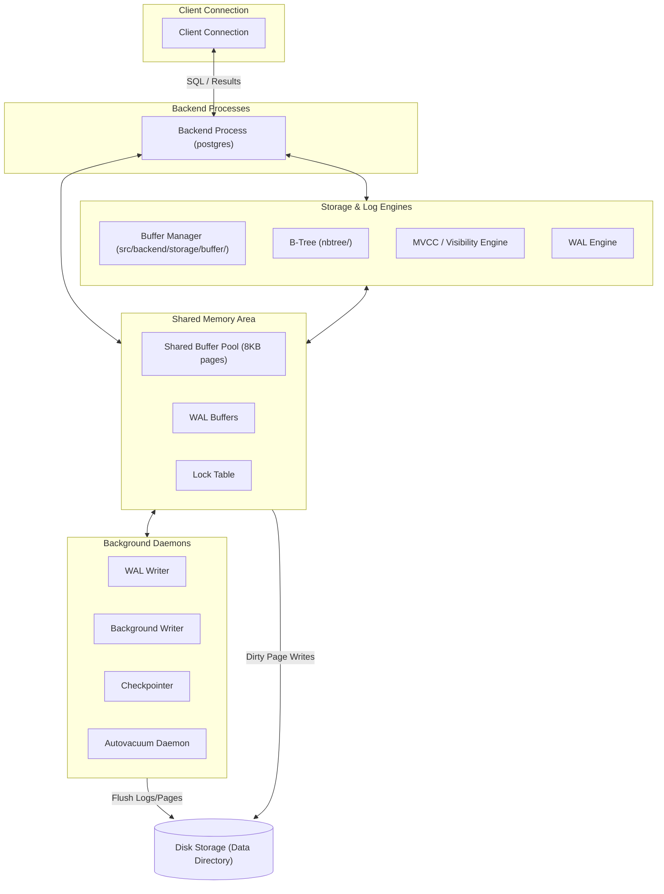

# Advanced DBMS: PostgreSQL Internal Architecture

This document explores the deep internals of **PostgreSQL**, focusing on its four core subsystems: the **Buffer Manager**, **B-Tree Indexing**, **Multi-Version Concurrency Control (MVCC)**, and **Write-Ahead Logging (WAL)**. It also presents query planning experiments and details how the PostgreSQL query optimizer uses system statistics to select execution plans.

---

## 1. Problem Background

PostgreSQL is designed as a highly concurrent, reliable, and extensible multi-user relational database server. To support these goals, its internal systems must address several fundamental challenges in database engineering:
- **I/O Latency**: Accessing physical disk is orders of magnitude slower than RAM. PostgreSQL needs an efficient caching layer (Buffer Manager) to minimize disk reads and writes.
- **Efficient Lookup**: Tables can grow to millions of rows. Linear scans are impractical, so PostgreSQL requires balanced on-disk index structures (B-Trees) to locate data in logarithmic time.
- **Concurrency without Bottlenecks**: In a multi-user environment, users must read and write data concurrently without blocking each other. PostgreSQL addresses this using Multi-Version Concurrency Control (MVCC).
- **Crash Recovery & Durability**: If the server loses power, modified data pages in RAM that haven't been written to disk could be lost. PostgreSQL uses Write-Ahead Logging (WAL) to guarantee durability and fast crash recovery.

---

## 2. Architecture Overview

PostgreSQL's internal architecture is structured around shared memory, dedicated backend processes, and specialized background daemons.



### Components and Data Flow:
1. **Query Processing**: The backend process parses the SQL query and compiles it into an execution plan.
2. **Buffer Access**: If the plan requires reading table or index pages, it requests them from the **Buffer Manager**.
3. **Index Evaluation**: The B-Tree engine searches index pages to identify Tuple IDs (`TIDs`).
4. **Visibility Filtering**: The MVCC engine checks the tuple headers (`xmin`/`xmax`) against the transaction's snapshot to filter out invisible versions.
5. **Modification & Logging**: For inserts/updates, new tuple versions are written, and changes are recorded in the **WAL Buffers**. The **WAL Writer** flushes these logs to disk before dirty database pages are written.

---

## 3. Internal Design

### The Buffer Manager

Located in the PostgreSQL source tree under `src/backend/storage/buffer/`, the Buffer Manager manages the transfer of database pages between disk and RAM.

#### Shared Buffers
The shared buffer pool is an array of page frames, each matching the database page size (typically **8 KB**). 
- **Page Caching**: The pool caches table heap pages and index pages.
- **Buffer Headers**: Each buffer frame has a header containing metadata, including the page's physical location (File Node, Fork Number, Block Number), a pin count (reference count of active backend sessions using the page), dirty flags, and a `usage_count`.

#### Buffer Replacement (Clock Sweep Algorithm)
To evict pages when the buffer pool is full, PostgreSQL implements the **Clock Sweep** page replacement algorithm (as simulated in Lab 3).

```text
       [Frame 0: usage_count=2, pinned=false]
                     ▲
                     │
[Frame 3: usage_count=0]  ◄─── (Clock Hand)  ───►  [Frame 1: usage_count=1, pinned=true]
                     │
                     ▼
       [Frame 2: usage_count=0, pinned=false]  <-- Victim Chosen for Eviction
```

1. **The Clock Hand**: A shared pointer sweeps sequentially through the buffer headers in a circular loop.
2. **Evaluation Rules**:
   - If a page is **pinned** (active read/write), the clock hand skips it.
   - If a page is unpinned and has a `usage_count > 0`, the clock hand decrements the count by `1` and moves to the next frame (giving the page a second chance).
   - If a page is unpinned and has a `usage_count == 0`, it is selected as the **eviction victim**.
3. **Pin Capping**: Every time a page is accessed, its `usage_count` is incremented, up to a maximum cap of `5`. This cap prevents sequential scans (which read many pages once) from flushing frequently accessed "hot" pages out of the cache.

---

### B-Tree Implementation (`nbtree`)

Located in `src/backend/access/nbtree/`, the `nbtree` code implements Lehman & Yao's high-concurrency B-Tree algorithm.

#### Index Structure & Page Layout
- **Page Layout**: Like heap pages, index pages are 8 KB. They contain a page header, item pointers, and index tuples (which store key values and target TIDs).
- **Lehman & Yao Modifications**: Each B-Tree page contains a **right-link pointer** pointing to its immediate right sibling at the same level.
- **High Concurrency Reads**: The right-link pointer allows search queries to traverse horizontally if a concurrent insert splits a page. This allows readers to search the index without acquiring read locks on parent nodes, minimizing lock contention.

```text
Level 1:            [ Parent Page ]
                     /           \
                    ▼             ▼
Level 0:      [ Leaf Page A ] ───► [ Leaf Page B ]
                             (Right-Link Pointer)
```

#### Search Path, Insert, and Page Splits
1. **Search Path**: The search descends the tree from the root to the leaf page by comparing keys.
2. **Insert Operation**: Inserts navigate to the target leaf page. If there is sufficient space, the key and target TID are inserted.
3. **Page Split**: If the leaf page is full:
   - A new sibling page is allocated.
   - The keys are split: approximately half remain on the original page, and the rest move to the new right sibling page.
   - The right-link pointer of the original page is updated to point to the new sibling page.
   - The median key is promoted to the parent index page. If the parent page is full, it splits recursively upward.

---

### Multi-Version Concurrency Control (MVCC)

PostgreSQL implements snapshot-based MVCC to ensure that read transactions do not block write transactions, and vice versa.

#### Heap Tuple Versioning (`xmin` / `xmax`)
Every row version (tuple) stored in a heap page contains visibility markers in its header:
- `xmin`: The transaction ID (`xid`) of the transaction that inserted the row.
- `xmax`: The transaction ID (`xid`) that updated or deleted the row. If the row is active and has not been modified, `xmax` is `0`.

An **UPDATE** is executed logically as a `DELETE` followed by an `INSERT`:
1. The `xmax` of the existing tuple is set to the current transaction ID.
2. A new tuple is inserted with its `xmin` set to the current transaction ID and `xmax` set to `0`.

#### Visibility Rules & Snapshot Isolation
When a transaction begins, it receives a snapshot consisting of:
- `xmin`: The lowest transaction ID that is still active (uncommitted). All transactions below this ID are committed and visible.
- `xmax`: The highest transaction ID assigned so far. All transactions at or above this ID are uncommitted and invisible.
- `active_xids`: A list of active transaction IDs between `xmin` and `xmax`.

For a tuple to be visible to a reader with transaction ID `T`:
1. The transaction that wrote it (`xmin`) must be **committed** and must be less than `T`'s snapshot `xmax` (and not in the `active_xids` list).
2. The transaction that deleted it (`xmax`) must either be **aborted**, not yet committed, or greater than `T`'s snapshot `xmax`.

#### Why VACUUM is Necessary
Because updates and deletes write new tuple versions rather than overwriting data in place, dead tuples accumulate in the heap pages over time (referred to as **bloat**).
- **VACUUM Cleanup**: The `autovacuum` daemon scans heap pages, identifies dead tuples (versions no longer visible to any active transaction), removes their index pointers, and marks their space in the page header as reusable.
- **Transaction ID Wraparound**: Transaction IDs are represented as 32-bit integers, which wrap around after ~4 billion transactions. The `VACUUM` process freezes old transaction IDs (marking them as frozen and universally visible) to prevent wraparound failures.

---

### Write-Ahead Logging (WAL)

The WAL engine ensures durability (the "D" in ACID) and crash recovery.

#### WAL Records & Flushes
Every change to a database page (heap or index) is recorded as a sequential change log entry in the **WAL Buffers** before the page is modified in the buffer pool.
- **WAL Protocol**: PostgreSQL enforces the Write-Ahead Log protocol: a dirty page in the shared buffer cache cannot be written to disk until the corresponding WAL record describing the change has been written and flushed to stable disk storage.
- **Synchronous Commit**: When a transaction commits, its commit WAL record is flushed to disk. The transaction is marked as committed only after the WAL flush completes, ensuring its changes survive a power loss.

#### Crash Recovery
If the server crashes:
1. **Redo Pass**: On startup, the recovery engine identifies the last recorded checkpoint.
2. **Replay**: It reads the WAL file sequentially from the checkpoint and reapplies all logged changes (REDO) to the database pages, restoring the database to a consistent state.

#### Checkpointing
Writing every modified page to disk on commit would cause significant random I/O bottlenecks. Instead, modifications are written to the sequential WAL log, and dirty database pages are flushed periodically.
- **The Checkpointer Process**: The checkpointer periodically writes all dirty pages in the shared buffer pool to disk and records a `CHECKPOINT` entry in the WAL log.
- **Log Truncation**: Once a checkpoint is written, all WAL records prior to the checkpoint are no longer needed for crash recovery and can be recycled or truncated, reclaiming disk space.

---

## 4. Design Trade-Offs

### Advantages
- **High Concurrency**: Readers do not acquire locks and do not block writers. Writers lock rows, not pages or tables, allowing high concurrent write throughput.
- **Reliable Durability**: The combination of WAL logging and the WAL protocol guarantees that committed transactions are durable, even during sudden power losses.
- **Extensible Indexes**: The decoupled design of heap files and index files allows PostgreSQL to support multiple index types (B-Tree, Hash, GIN, GiST, BRIN) pointing to the same heap.

### Limitations & Performance Implications
- **Double Buffering**: Relying on both PostgreSQL's `shared_buffers` and the OS page cache duplicate-caches data in RAM, reducing the memory available for other operations.
- **Autovacuum Overhead**: Cleaning up dead tuples requires significant I/O. If write volume is high, the autovacuum daemon can struggle to keep up, leading to table bloat and performance degradation.
- **Write Amplification**: An update to a single column requires writing a new version of the entire tuple to the heap and updating all secondary indexes to point to the new tuple's TID.

---

## 5. Experiments & Observations

To understand how query planners optimize execution plans, we ran join query introspection on our database. In this experiment, we joined a `students` table (which tracks student courses) with a `courses` table (which tracks course instructors).

### Experiment: Join Query Optimization
We evaluated the query plan of a join query:
```sql
SELECT * FROM students JOIN courses ON students.course = courses.course_name;
```

#### Case 1: Unindexed Join
Before creating an index on the join columns, the query planner generated this plan:

```text
QUERY PLAN
|--SCAN students
`--SEARCH courses USING AUTOMATIC COVERING INDEX (course_name=?)
```

##### Observations:
- **Nested Loop Join**: The planner scans the outer `students` table first (`SCAN students`).
- **Automatic Indexing**: Because there is no index on `courses(course_name)`, SQLite automatically creates a temporary covering index in memory to speed up lookups for each scanned student row. This avoids a full table scan of the `courses` table for every outer row.

#### Case 2: Indexed Join
We created a permanent index on the join key:
```sql
CREATE INDEX idx_courses_name ON courses(course_name);
```

The query plan updated to:
```text
QUERY PLAN
|--SCAN students
`--SEARCH courses USING INDEX idx_courses_name (course_name=?)
```

##### Observations:
- **Heuristic Optimization**: The planner uses the existing index (`idx_courses_name`), avoiding the overhead of creating a temporary index at runtime.

---

### How PostgreSQL Plan Decisions Differ

If this query were run in PostgreSQL, its cost-based optimizer (CBO) would evaluate three join strategies based on table statistics:

#### 1. Nested Loop Join
If the `students` table is small (e.g., a few hundred rows), PostgreSQL selects a Nested Loop Join. It scans `students` sequentially and uses the index on `courses` to find the corresponding course details.

```text
                                  QUERY PLAN
-------------------------------------------------------------------------------
 Nested Loop  (cost=0.15..12.30 rows=4 width=156)
   ->  Seq Scan on students  (cost=0.00..1.04 rows=4 width=84)
   ->  Index Scan using idx_courses_name on courses  (cost=0.15..2.81 rows=1 width=72)
         Index Cond: (course_name = (students.course)::text)
```

#### 2. Hash Join
If both tables are large and lack indexes on the join column, PostgreSQL builds a Hash Join:
- It scans the smaller table (e.g., `courses`) and builds an in-memory hash table using the join key.
- It scans the larger table (`students`) and probes the hash table to locate matching records.
- This is an $O(N + M)$ operation, which is faster than nested loops ($O(N \times M)$) on large, unindexed datasets.

```text
                               QUERY PLAN
------------------------------------------------------------------------
 Hash Join  (cost=1.10..2.25 rows=4 width=156)
   Hash Cond: ((students.course)::text = (courses.course_name)::text)
   ->  Seq Scan on students  (cost=0.00..1.04 rows=4 width=84)
   ->  Hash  (cost=1.02..1.02 rows=2 width=72)
         ->  Seq Scan on courses  (cost=0.00..1.02 rows=2 width=72)
```

#### 3. Merge Join
If both tables are large but already sorted by the join key (or can be scanned via sorted indexes), PostgreSQL performs a Merge Join. It scans both inputs in parallel, merging matching rows.

---

### The Role of `pg_statistic` & Planner Estimates

PostgreSQL's optimizer relies on the statistics collector to estimate the cost of each plan:
- **Analyze Process**: The `ANALYZE` command (or the autovacuum daemon) samples tables and updates the system catalog table `pg_statistic` (exposed via the user-friendly view `pg_stats`).
- **Collected Statistics**:
  - `null_frac`: Fraction of null values in a column.
  - `n_distinct`: Estimated number of distinct values.
  - `most_common_vals` (MCV) & `most_common_freqs` (MCF): A list of the most frequent values and their frequencies, allowing the planner to handle skewed distributions.
  - `histogram_bounds`: Values that divide the column data into equal-population buckets.
- **Cost Calculation**: The planner uses these statistics to estimate **selectivity** (the fraction of rows returned by a filter or join). It multiplies selectivity by table size to estimate row counts, which determines the I/O and CPU costs for plan alternatives.

---

## 6. Key Learnings

1. **Lock-Free Reads via MVCC**: By maintaining old tuple versions using `xmin`/`xmax`, readers build a snapshot of active transactions, allowing reads without locking.
2. **Sequential Scan Protection**: The Buffer Manager's Clock Sweep algorithm caps page access counts at `5`. This prevents sequential table scans from flushing frequently accessed index and lookup pages out of the shared buffer cache.
3. **Write-Ahead Logging Protocol**: The requirement to write change logs to disk before modifying actual data pages ensures durability and allows recovery from sudden power losses.
4. **Statistics-Driven Query Planning**: PostgreSQL's query optimizer is cost-based. Outdated statistics in `pg_statistic` can cause the planner to select inefficient join or scan strategies (e.g., choosing a Nested Loop instead of a Hash Join), highlighting the importance of regular vacuuming and analyzing.
