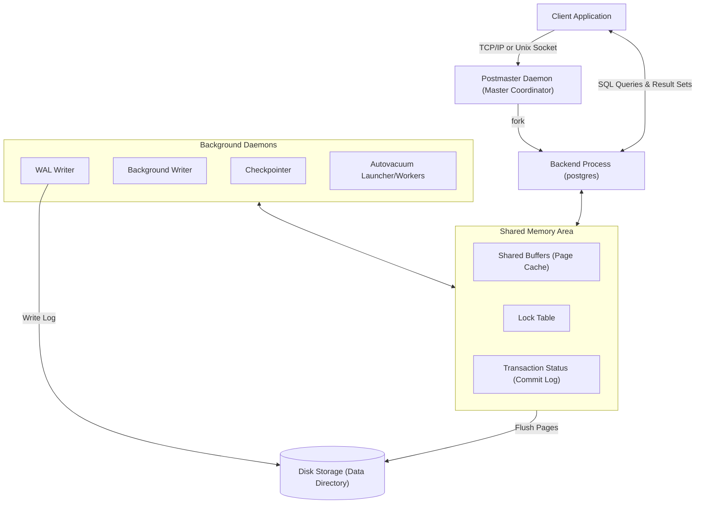
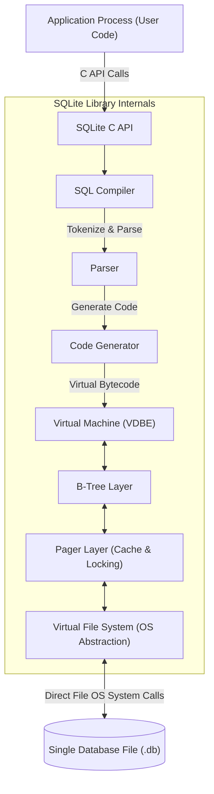

# Advanced DBMS: PostgreSQL vs. SQLite3 Architecture Comparison

This document presents a detailed architectural and system design comparison between **PostgreSQL** and **SQLite3**, two widely used database management systems built on fundamentally different design paradigms. The focus is to explore how their high-level architectural differences dictate their internal storage engines, memory management, concurrency control, transaction processing, and durability guarantees.

---

## 1. Problem Background

### Why They Exist & Historical Context

#### PostgreSQL
PostgreSQL (originally called **POSTGRES**) was conceived in 1986 at the University of California, Berkeley, under the leadership of Michael Stonebraker. It was designed as a successor to the INGRES database to address limitations in contemporary relational systems. Stonebraker sought to build an extensible object-relational database system that supported user-defined types, complex rules, object inheritance, and reliable transaction processing. 

PostgreSQL exists to serve as an **enterprise-class, multi-user relational database server**. It was engineered to handle high-concurrency workloads, enforce strict data integrity constraints, support massive datasets, and remain highly extensible (e.g., custom plugins, indexes, and programming languages).

#### SQLite3
SQLite was created in 2000 by D. Richard Hipp while working on software for US Navy guided-missile destroyers. The system they were using relied on a separate database server (Informix) that required significant administration. If the server went down or network connectivity was lost, the application failed. Hipp wanted a database engine that did not require installation, configuration, or a separate server process.

SQLite exists to be an **embedded, zero-configuration database library**. Its primary goal is to provide a local application file storage engine that supports standard SQL query capabilities without the operational overhead, IPC latency, or setup requirements of a database daemon.

### Summary of Design Goals
- **PostgreSQL**: Maximum concurrency, high write volume capability, extensive feature set, strict ACID enforcement, and scalability across large servers.
- **SQLite3**: Portability, zero configuration, simplicity, low memory footprint, and high single-user performance by running directly within the application's process.

---

## 2. Architecture Overview

### High-Level System Architecture

#### PostgreSQL (Client-Server, Multi-Process Model)
PostgreSQL operates as a client-server daemon. It employs a multi-process architecture where a master coordinator process (`postmaster`) listens on a network port (default `5432`). 

When a client application initiates a connection, the `postmaster` authenticates the client and forks a dedicated backend process (`postgres`) to handle that connection. These backend processes communicate via Shared Memory (`shared_buffers`, lock tables, CLOG status).



#### SQLite3 (In-Process, Library-Based Model)
SQLite has no server process. It is a C library that is compiled and linked directly into the client application process. All SQL processing, query execution, caching, and disk operations occur in the thread space and memory address space of the application itself.



### Data Flow for Queries & Writes
- **PostgreSQL**: Client sends a query over a socket → Backend process receives it, parses it, optimizes it ( CBO / Genetic Optimizer), checks the shared buffer cache, reads the heap files if there is a cache miss, acquires row-level locks, writes WAL records, modifies the pages in memory, and returns results over the network.
- **SQLite**: Application calls the SQLite library API → SQL statement is compiled into virtual machine bytecode (VDBE) → VDBE executes the bytecode instructions directly against the local B-Tree and page cache layers → Pager requests physical page locks from the operating system via the Virtual File System (VFS) → DB file is modified directly.

---

## 3. Internal Design

### Storage Structures

#### PostgreSQL (Heap-Based Storage)
PostgreSQL utilizes a heap-based storage structure. The files representing tables are split into fixed-size pages (typically **8 KB**). 

- **Heap Files**: Rows (tuples) are stored in heap pages. Each page has a header containing metadata, followed by line pointers (item pointers) pointing to the actual tuples.
- **Tuples**: Tuples grow from the bottom of the page upward, while line pointers grow from the top downward.
- **TID (Tuple ID)**: A physical address consisting of a block number (page offset) and an item offset. Indexes store these TIDs to reference heap rows.
- **TOAST (The Oversized-Attribute Storage Technique)**: Large field values (like big text/blobs) that exceed a page threshold are compressed and moved out of the main heap table into separate auxiliary TOAST tables.

#### SQLite3 (Single File Structure)
SQLite represents the entire database (schema, tables, indexes) as a single file on disk, divided into uniform pages (default **4 KB**, ranging from 512 B to 64 KB).

- **Page Types**: The single file contains various page types: Table B-Tree pages, Index B-Tree pages, overflow pages (for large columns), free list pages, and the database header page (Page 1).
- **B-Trees**: SQLite uses two kinds of B-Trees:
  - **Table B-Trees**: Keys are 64-bit signed integers (the `rowid`), and leaf nodes store the actual row data (payload).
  - **Index B-Trees**: Keys are the indexed columns combined with the `rowid`, and leaf nodes carry no additional data payload.

---

### Memory Management & Caching

#### PostgreSQL (Shared Buffer Pool)
PostgreSQL allocates a portion of the system RAM to `shared_buffers`, which acts as a cache for database pages.
- **Clock Sweep Algorithm**: PostgreSQL implements a variant of the Clock Sweep replacement algorithm (studied in Lab 3). Each page in the shared buffer pool carries a `usage_count` (0-5). The checkpointer sweeps circular buffers: if the page's count is > 0, it is decremented; if it is 0 and unpinned, it is evicted.
- **Double Buffering**: Because PostgreSQL uses standard file reads/writes, database pages are cached twice: once in PostgreSQL's `shared_buffers` and again in the host OS page cache.

#### SQLite3 (Process-Local Page Cache & Memory-Mapped I/O)
SQLite caches database pages inside the application's private process heap memory.
- **mmap I/O**: SQLite supports memory mapping (studied in Lab 2) via `PRAGMA mmap_size`. When configured, SQLite calls the OS `mmap()` system call to map the database file directly into the process's virtual address space.
  - **Syscall Bypass**: Reading mapped pages bypasses the kernel-to-user-space buffer copy and avoids the overhead of the `read()` syscall.
  - **Page Faults**: The operating system's Virtual Memory manager handles page fetching on demand.

---

### Index Organization

#### PostgreSQL
PostgreSQL B-Tree indexes are separate secondary files. 
- Leaf nodes contain the indexed key values and the physical `TID` of the matching row inside the heap file.
- There is no "primary clustered index" concept where table data is physically sorted by index key. All indexes (including primary keys) are secondary indexes pointing to heap locations.

#### SQLite3
SQLite tables are organized as clustered B+Trees by default.
- **RowID Clustered Index**: The key of the Table B-Tree is the `rowid`. Table data is clustered directly within the leaf nodes of the B-Tree.
- **WITHOUT ROWID Tables**: If a table is created with `WITHOUT ROWID`, it uses a true clustered index where the primary key is the B-Tree key and the non-primary columns form the B-Tree payload.
- **Secondary Indexes**: SQLite secondary indexes are organized as Index B-Trees. Leaf nodes contain the index key followed by the row's `rowid`, requiring a secondary lookup in the Table B-Tree to fetch non-indexed columns (unless the index is a "covering index").

---

### Transaction Processing & Concurrency Control

#### PostgreSQL (Multi-Version Concurrency Control)
PostgreSQL implements Multi-Version Concurrency Control (MVCC) to support high write-read concurrency:
- **Tuple Versioning**: Updates do not overwrite data in place. Instead, they insert a new version of the row into the heap page.
- **Header Metadata**: Each tuple header contains transaction visibility markers:
  - `xmin`: The transaction ID that inserted the tuple.
  - `xmax`: The transaction ID that updated or deleted the tuple (0 if still live).
- **Snapshot Isolation**: When a transaction starts, it receives a snapshot of active transaction IDs. It evaluates the visibility of each tuple using `xmin`/`xmax` values against its snapshot.
- **VACUUM**: A background daemon (`autovacuum`) must periodically scan pages to remove obsolete tuple versions (dead tuples) that are no longer visible to any transaction, reclaiming space.

#### SQLite3 (Lock-Based Concurrency & WAL Mode)
SQLite handles concurrency through file locks via the VFS layer.

##### Rollback Journal Mode (DELETE/TRUNCATE/PERSIST)
SQLite uses reader-writer locks on the database file:
- Readers acquire a `SHARED` lock. Multiple readers can read simultaneously.
- Writers must acquire an `EXCLUSIVE` lock, which blocks all readers. Only one transaction can access the database file during writes.
- Modified pages are written to the main file, and original pages are stored in a `.journal` file to allow rollback on crash.

##### Write-Ahead Log (WAL) Mode
WAL mode separates reads and writes:
- Modified pages are appended to a separate write-ahead log file (`.db-wal`).
- Readers read from a snapshot index (`.db-shm`) and scan both the main database file and the WAL file to locate the latest page version.
- **Concurrency**: One writer can write to the WAL concurrently with multiple readers reading. Write-write concurrency is still not supported (only one writer is allowed at a time).
- **Checkpointing**: Periodic checkpointers write the WAL pages back into the main database file.

---

### Recovery Mechanisms

| DBMS | Recovery Log | Process Description |
| :--- | :--- | :--- |
| **PostgreSQL** | Write-Ahead Log (WAL) | Writes changes sequentially to WAL buffers. Flushes to disk before modifications are written to the database heap pages. On crash, PostgreSQL performs REDO operations from the last checkpoint to restore state. |
| **SQLite (Journal)** | Rollback Journal | Writes a backup copy of modified database pages to a `.journal` file before applying updates to the main file. On crash, SQLite performs UNDO operations by rewriting the journal pages back to the database. |
| **SQLite (WAL)** | WAL File (`.db-wal`) | Writes changes directly to the WAL file. On crash, recovery parses the WAL file to identify the latest committed frame index, restoring the active state. |

---

## 4. Design Trade-Offs

### Comparative Analysis Matrix

| Design Dimension | PostgreSQL | SQLite3 |
| :--- | :--- | :--- |
| **Operational Model** | Client-Server (daemon process) | Embedded Library (in-process) |
| **Process Footprint** | Multi-process (Master + forks) | Single process (no background threads) |
| **IPC / Network Latency**| Significant (socket connection & serialization) | Zero (direct function calls in C) |
| **Concurrency Model** | Row-level locking + MVCC | File-level locking (WAL database-level) |
| **Write Throughput** | Very high (concurrent concurrent writers) | Low (serialized writes via single writer lock) |
| **Memory Footprint** | Large (pre-allocated Shared Buffers) | Minimal (scalable thread cache) |
| **Administration** | High (permissions, tuning, VACUUM) | Zero (self-contained, file-based) |
| **Extensibility** | High (plugins, custom languages, FDWs) | Low (extensions must compile with library) |

### Engineering Decisions & Performance Implications
- **Connection Overhead**: PostgreSQL incurs significant connection overhead. High-frequency short queries can suffer from network and backend fork latency, requiring a connection pooler (e.g., PgBouncer). SQLite completes queries in microseconds because there is no network layer.
- **Write Saturation**: Under concurrent write workloads, SQLite quickly bottleneck-locks the database file. PostgreSQL can scale write throughput across multiple CPU cores because it locks at the row level and uses MVCC for reads.
- **Data Footprint**: SQLite has very low storage overhead. It uses a single file and does not require extensive WAL archives or a system-wide transaction catalog. PostgreSQL requires transaction logs, catalog tables, and indexes, which increases disk space usage.

---

## 5. Experiments & Observations

To explore how the compiler and VDBE layout of SQLite works compared to a traditional client-server database, we ran query plans and bytecode introspection on a sample SQLite database (`students.db`) containing student records.

### Experiment 1: Non-Indexed Query Execution Plan & Bytecode
We analyzed the execution structure of a query scanning the `students` table to filter records by `age > 21` when no index is present.

#### Query Plan
```sql
EXPLAIN QUERY PLAN SELECT * FROM students WHERE age > 21;
```
**Output:**
```text
QUERY PLAN
`--SCAN students
```

#### Bytecode Execution (VDBE Instruction Set)
```sql
EXPLAIN SELECT * FROM students WHERE age > 21;
```
**Introspected Output:**
```text
addr  opcode         p1    p2    p3    p4             p5  comment      
----  -------------  ----  ----  ----  -------------  --  -------------
0     Init           0     15    0                    0   Start at 15
1     OpenRead       0     2     0     7              0   root=2 iDb=0; students
2     Rewind         0     14    0                    0   
3       Column         0     3     1                    0   r[1]= cursor 0 column 3
4       Le             2     13    1     BINARY-8       84  if r[1]<=r[2] goto 13
5       Column         0     0     3                    0   r[3]= cursor 0 column 0
6       Column         0     1     4                    0   r[4]= cursor 0 column 1
7       Column         0     2     5                    0   r[5]= cursor 0 column 2
8       Column         0     3     6                    0   r[6]= cursor 0 column 3
9       Column         0     4     7                    0   r[7]= cursor 0 column 4
10      Column         0     5     8                    0   r[8]= cursor 0 column 5
11      Column         0     6     9                    0   r[9]=students.created_at
12      ResultRow      3     7     0                    0   output=r[3..9]
13    Next           0     3     0                    1   
14    Halt           0     0     0                    0   
15    Transaction    0     0     1     0              1   usesStmtJournal=0
16    Integer        21    2     0                    0   r[2]=21
17    Goto           0     1     0                    0   
```

##### Code Analysis:
1. **Instruction 15-17 (`Init`)**: Initializes register `r[2]` with the constant value `21` and jumps back to instruction `1` to begin execution.
2. **Instruction 1 (`OpenRead`)**: Opens a read cursor (cursor `0`) on database page `2` (the root page of the `students` table B-Tree).
3. **Instruction 2 (`Rewind`)**: Positions cursor `0` at the first entry of the B-Tree. If the table is empty, it jumps to instruction `14` (`Halt`).
4. **Instruction 3-4 (`Column` & `Le`)**: Fetches column `3` (`age`) into register `r[1]`. Instruction `Le` compares if `r[1] <= r[2]` (i.e. `age <= 21`). If true, it skips the row and jumps to `13` (`Next`).
5. **Instruction 5-12 (`Column` & `ResultRow`)**: If the condition is met, it fetches columns `0` through `6` into registers `r[3]` through `r[9]` and yields a result row to the caller.
6. **Instruction 13 (`Next`)**: Advances the cursor to the next B-Tree cell and loops back to instruction `3`.

---

### Experiment 2: Indexed Query Execution Plan & Bytecode
We created an index on the `age` column to see how the optimizer and the VDBE instructions change.

```sql
CREATE INDEX idx_students_age ON students(age);
```

#### Query Plan
```sql
EXPLAIN QUERY PLAN SELECT * FROM students WHERE age > 21;
```
**Output:**
```text
QUERY PLAN
`--SEARCH students USING INDEX idx_students_age (age>?)
```

#### Bytecode Execution (VDBE Instruction Set)
```sql
EXPLAIN SELECT * FROM students WHERE age > 21;
```
**Introspected Output:**
```text
addr  opcode         p1    p2    p3    p4             p5  comment      
----  -------------  ----  ----  ----  -------------  --  -------------
0     Init           0     16    0                    0   Start at 16
1     OpenRead       0     2     0     7              0   root=2 iDb=0; students
2     OpenRead       1     5     0     k(2,,)         0   root=5 iDb=0; idx_students_age
3     Integer        21    1     0                    0   r[1]=21
4     SeekGT         1     15    1     1              0   key=r[1]
5       DeferredSeek   1     0     0                    0   Move 0 to 1.rowid if needed
6       Column         0     0     2                    0   r[2]= cursor 0 column 0
7       Column         0     1     3                    0   r[3]= cursor 0 column 1
8       Column         0     2     4                    0   r[4]= cursor 0 column 2
9       Column         1     0     5                    0   r[5]= cursor 1 column 0
10      Column         0     4     6                    0   r[6]= cursor 0 column 4
11      Column         0     5     7                    0   r[7]= cursor 0 column 5
12      Column         0     6     8                    0   r[8]=students.created_at
13      ResultRow      2     7     0                    0   output=r[2..8]
14    Next           1     5     0                    0   
15    Halt           0     0     0                    0   
16    Transaction    0     0     2     0              1   usesStmtJournal=0
17    Goto           0     1     0                    0   
```

##### Code Analysis:
1. **Instruction 2 (`OpenRead`)**: Opens a second cursor (cursor `1`) on page `5`, which contains the index B-Tree `idx_students_age`.
2. **Instruction 4 (`SeekGT`)**: Performs a binary search on the index B-Tree (cursor `1`) looking for keys greater than `21` (`SeekGT` = Seek Greater Than). If no matching keys are found, it jumps to address `15` (`Halt`).
3. **Instruction 5 (`DeferredSeek`)**: Rather than immediately seeking the main table heap B-Tree, it defers the search. If the bytecode needs column values that are not in the index, it uses the `rowid` from the index to locate the record in the main B-Tree (cursor `0`).
4. **Instruction 9 (`Column` on cursor 1)**: Reads register `r[5]` from cursor `1` (the index page itself), while other columns are read from cursor `0` (the table page) using the row pointer.
5. **Instruction 14 (`Next`)**: Advances cursor `1` on the index B-Tree. This is faster because it does not scan non-matching table data.

---

### Comparison with PostgreSQL Execution Plans
While SQLite compiles queries into virtual machine bytecode, PostgreSQL uses a tree-based executor. A similar query in PostgreSQL produces a nested execution plan with cost estimates:

```text
                               QUERY PLAN
-------------------------------------------------------------------------
 Index Scan using idx_students_age on students  (cost=0.15..8.20 rows=1 width=328)
   Index Cond: (age > 21)
```

#### Key Differences in Query Execution:
- **Heuristic VM vs. Compiled Tree**: SQLite's VDBE is a register-based VM. It translates SQL into sequential instructions. PostgreSQL compiles SQL into a logical plan, which is converted into a physical plan tree of execution nodes (e.g., `IndexScanNode`, `SeqScanNode`). The executor recursively calls `ExecProcNode()` to retrieve rows.
- **Optimizer Complexity**: SQLite's optimizer is relatively simple and relies on basic heuristic rules and stats. PostgreSQL uses a sophisticated Cost-Based Optimizer (CBO) that analyzes table density, page distributions, correlation coefficients (via `pg_statistic`), and histograms to decide between Sequential Scans, Index Scans, Bitmap Index Scans, or Hash Joins.

---

## 6. Key Learnings

1. **System Architecture Governs Internals**: SQLite's decision to be serverless and in-process eliminates network IPC, making it extremely fast for local, single-user applications (like mobile databases and application file formats). However, this design limits its ability to handle concurrent writes, since locking must occur at the database file level.
2. **PostgreSQL Multi-Process Scalability**: PostgreSQL's multi-process client-server model allows it to scale across multiple CPU cores. By dividing work among connection processes and background daemons, it can handle thousands of concurrent queries. The trade-off is the resource overhead of processes, shared memory buffers, and network connection latency.
3. **MVCC vs. File Locking Trade-offs**: MVCC (PostgreSQL) allows reads to proceed without blocking writes, which increases throughput. However, it requires a vacuuming strategy to clean up old row versions. SQLite's lock-based approach keeps the database file compact, but writers block readers (in rollback journal mode) or restrict write throughput to a single process (in WAL mode).
4. **B-Tree Layout Decisions**: SQLite's clustered Table B-Trees align table rows directly with their `rowid` index, optimizing primary key lookups. PostgreSQL's heap-based design separates index pointers from data blocks, allowing flexible secondary index types (B-Tree, GiST, GIN, BRIN) at the cost of heap page lookups.
