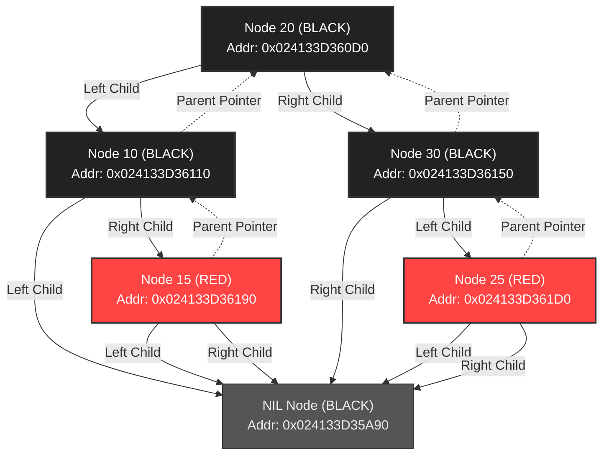

# Red-Black Tree Memory & Pointer Architecture

This repository contains a comprehensive lab session analyzing the memory-level pointer layout of a self-balancing Red-Black Tree. In memory-resident data structures like Red-Black Trees, nodes are linked together via raw memory pointers (memory addresses) rather than disk offsets.

---

## 1. Quick Start & Reproducibility

To run the Red-Black Tree pointer mapping:

1. **Execute the Python Mapping**: Creates the tree, performs inserts, triggers rotation fixups, and dumps the memory addresses of the nodes and pointers.
   ```bash
   python rbt.py
   ```

---

## 2. Red-Black Tree Invariants & Properties

A Red-Black Tree is a self-balancing binary search tree where each node is colored either **RED** or **BLACK**. It maintains balancing through five core properties:

1. Every node is either **RED** or **BLACK**.
2. The root node is always **BLACK**.
3. Every leaf (represented by the sentinel `NIL` node) is **BLACK**.
4. If a node is **RED**, both of its children must be **BLACK** (no two adjacent RED nodes on any path).
5. For each node, all simple paths from the node to descendant leaves contain the same number of black nodes (the "black-height" property).

---

## 3. Node Memory Layout

Unlike B-Trees that write layout records to contiguous disk segments, memory-resident nodes are allocated dynamically. A standard Red-Black Tree node contains five key fields in memory:

```text
+-----------------------+
|  Parent Node Pointer  |
+-----------------------+
|   Left Child Pointer  |
+-----------------------+
|  Right Child Pointer  |
+-----------------------+
|   Key Value (Data)    |
+-----------------------+
|      Color Flag       |
+-----------------------+
```

Each pointer field holds the absolute memory address of another Node object in RAM.

---

## 4. Real Memory Pointer Dump

Below is the execution dump of our tree after inserting keys `[10, 20, 30, 15, 25]` and performing balancing rotations.

```text
NIL Node Address: 0x024133D35A90
Root Address:     0x024133D360D0

[Root] Key:  20 | Color: BLACK | NodeAddr: 0x024133D360D0 | ParentAddr: 0x000000000000 | LeftAddr: 0x024133D36110 | RightAddr: 0x024133D36150
  [Left] Key:  10 | Color: BLACK | NodeAddr: 0x024133D36110 | ParentAddr: 0x024133D360D0 | LeftAddr: 0x000000000000 (NIL) | RightAddr: 0x024133D36190
    [Right] Key:  15 | Color: RED   | NodeAddr: 0x024133D36190 | ParentAddr: 0x024133D36110 | LeftAddr: 0x000000000000 (NIL) | RightAddr: 0x000000000000 (NIL)
  [Right] Key:  30 | Color: BLACK | NodeAddr: 0x024133D36150 | ParentAddr: 0x024133D360D0 | LeftAddr: 0x024133D361D0 | RightAddr: 0x000000000000 (NIL)
    [Left] Key:  25 | Color: RED   | NodeAddr: 0x024133D361D0 | ParentAddr: 0x024133D36150 | LeftAddr: 0x000000000000 (NIL) | RightAddr: 0x000000000000 (NIL)
```

---

## 5. Pointer Resolution & Structure Mapping

Using the memory addresses generated by the dump, we can map the exact parent-child relations and verify balance:

| Key | Color | Node Address (`id(node)`) | Parent Address | Left Child Address | Right Child Address | Relation Analysis |
| :--- | :--- | :--- | :--- | :--- | :--- | :--- |
| **20** | BLACK | `0x024133D360D0` | `0x000000000000` | `0x024133D36110` | `0x024133D36150` | **Root node**. Parent pointer is null. Children are Nodes 10 and 30. |
| **10** | BLACK | `0x024133D36110` | `0x024133D360D0` | `NIL` (`0x024133D35A90`) | `0x024133D36190` | Left child of Root. Left pointer points to NIL. Right pointer is Node 15. |
| **15** | RED | `0x024133D36190` | `0x024133D36110` | `NIL` (`0x024133D35A90`) | `NIL` (`0x024133D35A90`) | Leaf. Parent is Node 10. Children are both NIL. |
| **30** | BLACK | `0x024133D36150` | `0x024133D360D0` | `0x024133D361D0` | `NIL` (`0x024133D35A90`) | Right child of Root. Left pointer is Node 25. Right pointer points to NIL. |
| **25** | RED | `0x024133D361D0` | `0x024133D36150` | `NIL` (`0x024133D35A90`) | `NIL` (`0x024133D35A90`) | Leaf. Parent is Node 30. Children are both NIL. |

---

## 6. Balancing and Rotation Mechanics

To maintain $O(\log n)$ search limits during insertion, nodes undergo Left/Right rotations to distribute weight. A rotation swaps the child-parent relationship of adjacent nodes while preserving binary search ordering.

### A. Left Rotation (around Node `X`)
```text
      X                     Y
     / \     LeftRotate    / \
    A   Y    --------->   X   C
       / \               / \
      B   C             A   B
```
**Pointer updates during Left Rotation**:
1. Set `X.right` to `Y.left`.
2. Update `Y.left.parent` to `X` (if not NIL).
3. Update `Y.parent` to `X.parent` (updating the parent's child reference to point to `Y` instead of `X`).
4. Set `Y.left` to `X`.
5. Update `X.parent` to `Y`.

---

## 7. Visualizing the Pointer Structure

### A. Educational Infographic
Below is the visual structure showing the nodes, their colors, their virtual memory addresses, parent pointer links, and child pointer links.


### B. Pointer Traversal Path

