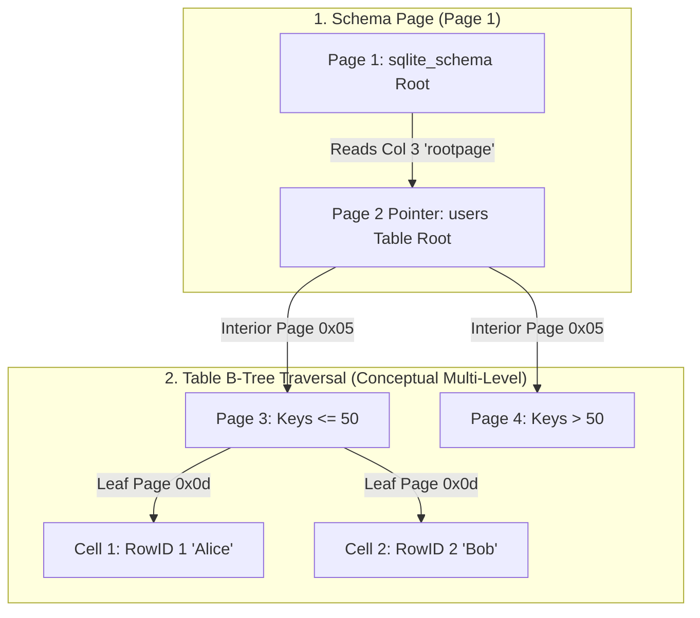

# SQLite3 B-Tree File Format Deep Dive & Hex Analysis

This repository contains a comprehensive lab session analyzing the binary structure of a SQLite3 database file down to the byte level. By configuring a small page size of 512 bytes, we isolate page structures and inspect the Database File Header, B-Tree Page Headers, Cell Pointer Arrays, and Record payloads.

---

## 1. Quick Start & Reproducibility

To recreate the database and execute the programmatic byte-level parsing:

1. **Generate the Database**: Runs the SQLite generation script, which creates `lab.db` (512-byte page size, journaling disabled) and inserts three sample records.
   ```bash
   python create_db.py
   ```
2. **Generate the Hex Dump**: Produce the `xxd` style hex output.
   ```bash
   xxd lab.db > lab.hex
   ```
3. **Execute programmatic parser**: Run our custom validation script to automatically decode page headers, varints, and record serial types.
   ```bash
   python parse_db.py
   ```

---

## 2. The Real Hex Dump (`xxd lab.db`)

Below is the complete, unmodified hex dump of our 1024-byte SQLite3 database containing exactly 2 pages (512 bytes each).

```text
00000000: 5351 4c69 7465 2066 6f72 6d61 7420 3300  SQLite format 3.
00000010: 0200 0101 0040 2020 0000 0002 0000 0002  .....@  ........
00000020: 0000 0000 0000 0000 0000 0001 0000 0004  ................
00000030: 0000 0000 0000 0000 0000 0001 0000 0000  ................
00000040: 0000 0000 0000 0000 0000 0000 0000 0000  ................
00000050: 0000 0000 0000 0000 0000 0000 0000 0002  ................
00000060: 002e 7689 0d00 0000 0101 8600 0186 0000  ..v.............
00000070: 0000 0000 0000 0000 0000 0000 0000 0000  ................
*
00000180: 0000 0000 0000 7801 0717 1717 0181 4f74  ......x.......Ot
00000190: 6162 6c65 7573 6572 7375 7365 7273 0243  ableusersusers.C
000001a0: 5245 4154 4520 5441 424c 4520 7573 6572  CREATE TABLE user
000001b0: 7320 280a 2020 2020 6964 2049 4e54 4547  s (.    id INTEG
000001c0: 4552 2050 5249 4d41 5259 204b 4559 2c0a  ER PRIMARY KEY,.
000001d0: 2020 2020 6e61 6d65 2054 4558 5420 4e4f      name TEXT NO
000001e0: 5420 4e55 4c4c 2c0a 2020 2020 726f 6c65  T NULL,.    role
000001f0: 2054 4558 5420 4e4f 5420 4e55 4c4c 0a29   TEXT NOT NULL.)
00000200: 0d00 0000 0301 c500 01f0 01dc 01c5 0000  ................
00000210: 0000 0000 0000 0000 0000 0000 0000 0000  ................
*
000003c0: 0000 0000 0015 0304 001b 2143 6861 726c  ..........!Charl
000003d0: 6965 4d61 696e 7461 696e 6572 1202 0400  ieMaintainer....
000003e0: 1323 426f 6243 6f6e 7472 6962 7574 6f72  .#BobContributor
000003f0: 0e01 0400 1717 416c 6963 6541 646d 696e  ......AliceAdmin
```
*(Note: lines containing only zeroes are represented with `*` by `xxd`)*

---

## 3. Database File Header (Bytes 0 to 99)

Every SQLite3 database file begins with a 100-byte file header on Page 1. Below is the mapping of our header bytes starting at offset `0x0000`:

| Hex Offset | Byte Length | Field Description | Value in Hex | Decoded Value |
| :--- | :--- | :--- | :--- | :--- |
| `0x00` | 16 | Header Magic String | `5351 4c69 7465 2066 6f72 6d61 7420 3300` | `"SQLite format 3\0"` |
| `0x10` | 2 | Page Size (bytes) | `02 00` | `512` (0x0200 = 512 bytes) |
| `0x12` | 1 | File format write version | `01` | `1` (Legacy journaling format) |
| `0x13` | 1 | File format read version | `01` | `1` (Legacy journaling format) |
| `0x14` | 1 | Reserved space at end of page | `00` | `0` bytes reserved |
| `0x15` | 1 | Max embedded payload fraction | `40` | `64` (Must be 64) |
| `0x16` | 1 | Min embedded payload fraction | `20` | `32` (Must be 32) |
| `0x17` | 1 | Leaf payload fraction | `20` | `32` (Must be 32) |
| `0x18` | 4 | File change counter | `00 00 00 02` | `2` file modifications |
| `0x1c` | 4 | Database size in pages | `00 00 00 02` | `2` pages (1024 total bytes) |
| `0x20` | 4 | Page of first freelist trunk | `00 00 00 00` | `0` (No freelist pages) |
| `0x24` | 4 | Total freelist pages | `00 00 00 00` | `0` |
| `0x28` | 4 | Schema Cookie | `00 00 00 01` | `1` |
| `0x2c` | 4 | Schema Format Number | `00 00 00 04` | `4` (SQLite 3.0.0+) |
| `0x30` | 4 | Default Page Cache Size | `00 00 00 00` | `0` (No preference) |
| `0x34` | 4 | Largest root B-Tree page (vacuum) | `00 00 00 00` | `0` |
| `0x38` | 4 | Text Encoding | `00 00 00 01` | `1` (UTF-8) |
| `0x3c` | 4 | User Version | `00 00 00 00` | `0` |
| `0x40` | 4 | Incremental Vacuum Mode | `00 00 00 00` | `0` (False) |
| `0x44` | 4 | Application ID | `00 00 00 00` | `0` |
| `0x48` | 20 | Reserved for expansion | All `00` | Zeroed padding |
| `0x5c` | 4 | Version-valid-for number | `00 00 00 02` | `2` (Matches file change counter) |
| `0x60` | 4 | SQLite Version Number | `00 2e 76 89` | `3045001` (SQLite 3.45.1) |

---

## 4. B-Tree Page Header Structure

B-Tree pages in SQLite can be one of four types, declared in the very first byte of the page header:
- **`0x02`**: Index Interior Page (contains pointers to child index pages and routing keys).
- **`0x05`**: Table Interior Page (contains pointers to child data pages and routing RowIDs).
- **`0x0a`**: Index Leaf Page (contains key data and RowIDs).
- **`0x0d`**: Table Leaf Page (contains actual row payload values).

### Page Header Field Layouts
- **Leaf Pages (`0x0a`, `0x0d`)** have an **8-byte header**:
  - **Byte 0**: Page Type Flag.
  - **Bytes 1-2**: Offset to first freeblock (`0` if none).
  - **Bytes 3-4**: Number of cells on this page.
  - **Bytes 5-6**: Start of cell content area (offset from page start).
  - **Byte 7**: Number of fragmented free bytes.
- **Interior Pages (`0x02`, `0x05`)** have a **12-byte header** because they add a 4-byte page pointer at the end:
  - **Bytes 8-11**: Right-Child Page Number.

---

## 5. Detailed Page 1 Analysis: Schema B-Tree Leaf (`sqlite_schema`)

Page 1 contains both the 100-byte Database File Header and the root B-Tree page of the SQLite schema table (`sqlite_schema`).

### A. B-Tree Page Header (Offsets `0x64` to `0x6b`)
The B-Tree header starts directly at byte 100 (`0x64`):
- `0x64`: `0d` $\rightarrow$ **Table Leaf Page** (`0x0d`).
- `0x65 - 0x66`: `00 00` $\rightarrow$ No freeblocks.
- `0x67 - 0x68`: `00 01` $\rightarrow$ **1 cell** resides on this page (the table definition record).
- `0x69 - 0x6a`: `01 86` $\rightarrow$ Cell content starts at page offset `0x0186` (decimal 390).
- `0x6b`: `00` $\rightarrow$ `0` fragmented free bytes.

### B. Cell Pointer Array (Offsets `0x6c` to `0x6d`)
Directly following the B-tree header is the Cell Pointer Array, containing `num_cells` (1) two-byte offsets:
- `0x6c - 0x6d`: `01 86` $\rightarrow$ Pointing to Cell 1 at page offset `0x0186`.

### C. Cell 1 Record Parsing (Offsets `0x0186` to `0x01ff`)
Let's decode the cell structure at offset `0x0186`:
1. **Payload Size**: `78` (Varint $\rightarrow$ **120 bytes**).
2. **RowID**: `01` (Varint $\rightarrow$ **1**).
3. **Payload Data** starts at `0x0188` (size 120 bytes):
   - **Record Header Size**: `07` (Varint $\rightarrow$ **7 bytes**). Includes offsets `0x188` through `0x18e`.
   - **Serial Types Array** (5 columns in `sqlite_schema` table):
     - Col 0 (`type`): `17` (Varint $\rightarrow$ 23). Odd, $\ge 13 \rightarrow$ TEXT of length $\frac{23 - 13}{2} = 5$ bytes.
     - Col 1 (`name`): `17` (Varint $\rightarrow$ 23). TEXT of length 5 bytes.
     - Col 2 (`tbl_name`): `17` (Varint $\rightarrow$ 23). TEXT of length 5 bytes.
     - Col 3 (`rootpage`): `01` (Varint $\rightarrow$ 1). 1-byte signed integer.
     - Col 4 (`sql`): `81 4f` (Varint). Decodes as:
       - `0x81` $\rightarrow$ High bit set, payload bits `0000001`
       - `0x4f` $\rightarrow$ High bit cleared, payload bits `1001111`
       - Combined value: `0b00000011001111` = `207` decimal.
       - Decodes to: TEXT of length $\frac{207 - 13}{2} = \mathbf{97}$ bytes.
   - **Column Values**:
     - **Col 0 (`type`)**: `74 61 62 6c 65` $\rightarrow$ **`"table"`**
     - **Col 1 (`name`)**: `75 73 65 72 73` $\rightarrow$ **`"users"`**
     - **Col 2 (`tbl_name`)**: `75 73 65 72 73` $\rightarrow$ **`"users"`**
     - **Col 3 (`rootpage`)**: `02` $\rightarrow$ **`2`** (Page 2 contains the root B-Tree of the `users` table).
     - **Col 4 (`sql`)**: `43 52 45 ... 0a 29` $\rightarrow$ **`"CREATE TABLE users (\n    id INTEGER PRIMARY KEY,\n    name TEXT NOT NULL,\n    role TEXT NOT NULL\n)"`** (exactly 97 bytes).

---

## 6. Detailed Page 2 Analysis: `users` Table B-Tree Leaf

Page 2 (absolute file offset `0x0200` to `0x03FF`) holds the row entries for our `users` table.

### A. B-Tree Page Header (Offsets `0x200` to `0x207`)
- `0x200`: `0d` $\rightarrow$ **Table Leaf Page** (`0x0d`).
- `0x201 - 0x202`: `00 00` $\rightarrow$ No freeblocks.
- `0x203 - 0x204`: `00 03` $\rightarrow$ **3 cells** reside on this page.
- `0x205 - 0x206`: `01 c5` $\rightarrow$ Cell content area starts at offset `0x01c5` (absolute `0x03c5`).
- `0x207`: `00` $\rightarrow$ `0` fragmented free bytes.

### B. Cell Pointer Array (Offsets `0x208` to `0x20d`)
Stores 3 cell pointers, sorted by key (RowID 1, 2, 3):
- **Cell 1**: `01 f0` $\rightarrow$ Page offset `0x01f0` (absolute `0x03f0`)
- **Cell 2**: `01 dc` $\rightarrow$ Page offset `0x01dc` (absolute `0x03dc`)
- **Cell 3**: `01 c5` $\rightarrow$ Page offset `0x01c5` (absolute `0x03c5`)

*Note: SQLite writes cells backward from the end of the page. Cell 1 is at the bottom, and Cell 3 is stacked above it.*

```
+-------------------------------------------------------------+
| B-Tree Header (8 Bytes) | Cell Pointers [0x1f0, 0x1dc, 0x1c5]| -> Grows forward
|                        Unallocated Space                    |
|                        ...                                  |
| [Cell 3: Charlie (0x1c5)] [Cell 2: Bob (0x1dc)] [Cell 1: Alice (0x1f0)] | <- Grows backward
+-------------------------------------------------------------+
```

### C. Cell 1 Record: Alice (Offsets `0x03f0` to `0x03ff`)
- `0x03f0`: `0e` $\rightarrow$ Payload Size: **14 bytes**
- `0x03f1`: `01` $\rightarrow$ RowID: **1**
- **Payload** starts at `0x03f2`:
  - **Record Header**: `04 00 17 17`
    - `04` $\rightarrow$ Header size is 4 bytes.
    - `00` $\rightarrow$ Col 0 (`id`): Serial type `0` (NULL). Since `id` is an `INTEGER PRIMARY KEY`, its value is optimized out of the payload and mapped directly to the row's RowID (1).
    - `17` $\rightarrow$ Col 1 (`name`): TEXT, length $\frac{23 - 13}{2} = 5$ bytes.
    - `17` $\rightarrow$ Col 2 (`role`): TEXT, length 5 bytes.
  - **Data Values**:
    - `name` bytes (`0x3f6 - 0x3fa`): `41 6c 69 63 65` $\rightarrow$ **`"Alice"`**
    - `role` bytes (`0x3fb - 0x3ff`): `41 64 6d 69 6e` $\rightarrow$ **`"Admin"`**

### D. Cell 2 Record: Bob (Offsets `0x03dc` to `0x03ef`)
- `0x03dc`: `12` $\rightarrow$ Payload Size: **18 bytes**
- `0x03dd`: `02` $\rightarrow$ RowID: **2**
- **Payload** starts at `0x03de`:
  - **Record Header**: `04 00 13 23`
    - `04` $\rightarrow$ Header size: 4 bytes.
    - `00` $\rightarrow$ Col 0 (`id`): Mapped to RowID (2).
    - `13` $\rightarrow$ Col 1 (`name`): TEXT, length $\frac{19 - 13}{2} = 3$ bytes.
    - `23` $\rightarrow$ Col 2 (`role`): TEXT, length $\frac{35 - 13}{2} = 11$ bytes.
  - **Data Values**:
    - `name` bytes (`0x3e2 - 0x3e4`): `42 6f 62` $\rightarrow$ **`"Bob"`**
    - `role` bytes (`0x3e5 - 0x3ef`): `43 6f 6e 74 72 69 62 75 74 6f 72` $\rightarrow$ **`"Contributor"`**

### E. Cell 3 Record: Charlie (Offsets `0x03c5` to `0x03db`)
- `0x03c5`: `15` $\rightarrow$ Payload Size: **21 bytes**
- `0x03c6`: `03` $\rightarrow$ RowID: **3**
- **Payload** starts at `0x03c7`:
  - **Record Header**: `04 00 1b 21`
    - `04` $\rightarrow$ Header size: 4 bytes.
    - `00` $\rightarrow$ Col 0 (`id`): Mapped to RowID (3).
    - `1b` $\rightarrow$ Col 1 (`name`): TEXT, length $\frac{27 - 13}{2} = 7$ bytes.
    - `21` $\rightarrow$ Col 2 (`role`): TEXT, length $\frac{33 - 13}{2} = 10$ bytes.
  - **Data Values**:
    - `name` bytes (`0x3cb - 0x3d1`): `43 68 61 72 6c 69 65` $\rightarrow$ **`"Charlie"`**
    - `role` bytes (`0x3d2 - 0x3db`): `4d 61 69 6e 74 61 69 6e 65 72` $\rightarrow$ **`"Maintainer"`**

---

## 7. B-Tree Navigation, Node Pointers & Lookup Mechanics

In a real production database with thousands of records, the data splits across multiple pages, forming a tree structure. 

### A. B-Tree Page Pointers & Structural Elements
SQLite B-Trees utilize page pointers to link nodes together:
1. **Left-Child Pointers in Cells**: In an interior page (either Table or Index B-Tree), each cell contains a 4-byte big-endian integer child page number. The subtree under this child contains only keys/RowIDs $\le$ the key in the cell.
2. **Right-Child Pointer in Page Header**: The 4-byte right-child pointer (bytes 8-11 of an interior page header) points to a page containing all keys/RowIDs greater than the largest key in the page's cells.
3. **Root Page Pointers in Schemas**: As shown in Page 1, Cell 1, the `sqlite_schema` table stores the `rootpage` field as an integer. This serves as the entry point to navigation.

### B. Table B-Tree (RowID Lookup) vs. Index B-Tree (Key/Value Lookup)
SQLite maintains two distinct B-Tree variations depending on what is being searched:

#### 1. Table B-Trees (Key $\rightarrow$ Data)
- **Leaves**: Type `0x0d` (Table Leaf). They store actual row values.
- **Interiors**: Type `0x05` (Table Interior). They contain cells containing only `[4-byte Left-Child Page Pointer, RowID Key]`.
- **Lookup Path (`SELECT * FROM users WHERE id = 3`)**:
  1. The engine checks the schema to find the root page of the `users` table (here, Page 2).
  2. If the root page were an **Interior Table Page (Type `0x05`)**, the engine would binary-search the cell keys:
     - If the target RowID is $\le$ a cell's RowID, follow the cell's Left-Child pointer.
     - If the target RowID is $>$ all cell RowIDs in the page, follow the Right-Child pointer.
  3. This continues down until a **Leaf Table Page (Type `0x0d`)** is reached.
  4. The engine binary-searches the leaf's cell pointer array to locate the matching cell, then parses the record payload to extract the data values.

#### 2. Index B-Trees (Index-Key $\rightarrow$ RowID)
- **Leaves**: Type `0x0a` (Index Leaf). They do *not* contain table payloads. They store a serialized key (e.g., indexed column values) followed by the corresponding row's RowID.
- **Interiors**: Type `0x02` (Index Interior). They contain cells containing `[4-byte Left-Child Page Pointer, Serialized Index-Key + RowID]`.
- **Lookup Path (`SELECT * FROM users WHERE name = 'Bob'`)**:
  1. The engine finds the root page of the index B-Tree.
  2. It traverses from interior nodes to leaf nodes by comparing the serialized query keys.
  3. Once at the Leaf Index Page (Type `0x0a`), it finds the entry for `"Bob"` and reads the associated RowID (which is `2`).
  4. It then initiates a secondary traversal on the main **Table B-Tree** using RowID `2` to fetch the actual columns.

### C. Visualizing the B-Tree Traversals




---

## 8. Summary of Addresses and Offsets for `lab.db`

- **`0x0000 - 0x0063`**: SQLite 100-byte File Header (Contains page size `512` and schema metadata).
- **`0x0064 - 0x006b`**: Page 1 B-Tree Page Header (Table Leaf page type `0x0d`, `1` cell).
- **`0x006c - 0x006d`**: Page 1 Cell Pointer Array (Points to offset `0x0186`).
- **`0x0186 - 0x01ff`**: Page 1 Cell Content (Payload describing the schema for table `users`, specifying root B-tree page at `0x02`).
- **`0x0200 - 0x0207`**: Page 2 B-Tree Page Header (Table Leaf page type `0x0d`, `3` cells).
- **`0x0208 - 0x020d`**: Page 2 Cell Pointer Array (Offsets `0x01f0`, `0x01dc`, `0x01c5`).
- **`0x03c5 - 0x03db`**: Page 2 Cell 3 (RowID 3, Charlie, Maintainer).
- **`0x03dc - 0x03ef`**: Page 2 Cell 2 (RowID 2, Bob, Contributor).
- **`0x03f0 - 0x03ff`**: Page 2 Cell 1 (RowID 1, Alice, Admin).
